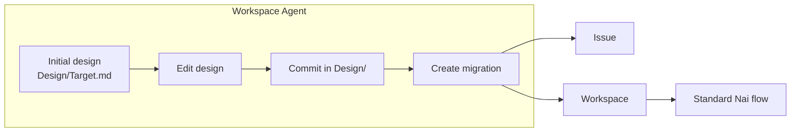

# Nai Design Add-on

An optional add-on for [Nai](https://github.com/piontkovsk11andre1/nai) that adds a workflow-wide `Design/` repository — a single **project-level control point** you drive from Nai's top-level agent.

## What it is for

In one sentence: keep design as a long-lived top-level source of truth, and let drift between design and code automatically turn into issues, workspaces, and staged migration plans.

Concretely, this add-on lets you:

1. **Define design** — write high-level design directly into `Design/`, indexed by `Design/Target.md`.
2. **Scan design from current implementation** — point the agent at existing repos and have it reverse-engineer the design corpus into `Design/`.
3. **Use design as a project-level control point** — `Design/` sits above individual workspaces and represents what the project *should* be.
4. **Convert drift into work** — changes between design and reality (or edits to the design itself) are derived into Issues, Workspaces, plans, and staged workloads.
5. **Drive everything from the Nai top-level agent** — no separate CLI or UI; you talk to the Workspace Agent and it reads, edits, commits, reverts `Design/`, and spawns the implementation work.

## How it plugs into Nai

The main Nai workflow (Git / Research / Planner / Worker / Reviewer roles, per-workspace git worktrees, queue-based execution) stays exactly the same. This add-on adds **one top-level repository**, `Design/`, next to `Workspaces/`, `Scripts/`, and `Prompts/`.

## Install

In the root of an existing Nai installation, run `Open Agent` and send one message:

> Please read <https://raw.githubusercontent.com/piontkovsk11andre1/nai-design-addon/main/INSTALL.md>
> and apply this add-on to the current Nai workflow.

The agent creates `Design/` as a local git repo with `Design/Target.md` as the initial commit, and updates `Prompts/Workspace Agent.md` so it knows how to use it.

## How to use it

Open the top-level launcher and ask the Workspace Agent things like:

- "Scan the repos and draft an initial `Design/` from what's there."
- "Summarize the design: what's stable, what can change independently, what should become issues vs. workspaces vs. migration steps."
- "Edit `Design/<file>.md` to change X, then commit the design."
- "Diff the last design commit and propose issues, workspace splits, and migration stages."
- "Create a workspace for the derived item and hand it to Planner."
- "Revert the last design commit."

`Design/` is **not** part of `Workspaces/__template__/` and is **not** a per-workspace repository — it is the project-level layer above them.

## License

[MIT](LICENSE)
